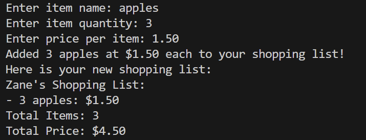

# CLI App Project: Shopping List 
## Overview

This project is a simple command-line task manager where users can add, remove and view items in their own shopping list. The application stores items in an array of class instances, gives users options through prompts, and uses array iteration and array methods to handle interactions with tasks.

## Key Features & Usage Example
After running the application, the user is presented with a menu of options. They can:
1. Add an item, along with its price and quantity, to their shopping list.
2. Remove an item from their shopping list
3. View all items in shopping list
4. Exit the application.

In the screenshot below, you can see a user selecting the "Add Item" option and entering their item, along with its quantity and price.



## Setup

Follow these steps to get started:

```sh
# Clone the repo
git clone [repo_url]
cd [repo_name]

# Install dependencies
npm install

# Run the src/start.js file
node src/index.js
```
## Key Technologies & Packages

* Node
* `prompt-sync`